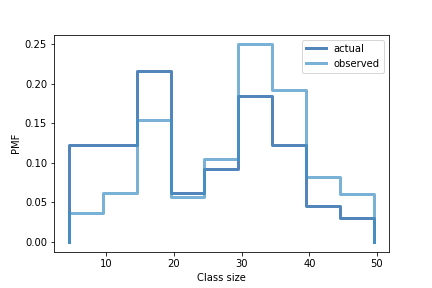

[Think Stats Chapter 3 Exercise 1](http://greenteapress.com/thinkstats2/html/thinkstats2004.html#toc31) (actual vs. biased)

**Exercise:** Something like the class size paradox appears if you survey children and ask how many children are in their family. Families with many children are more likely to appear in your sample, and families with no children have no chance to be in the sample.

Use the NSFG respondent variable `numkdhh` to construct the actual distribution for the number of children under 18 in the respondents' households.
```python
# import data
resp = nsfg.ReadFemResp()
data = resp.numkdhh
pmf = thinkstats2.Pmf(data, label ='numkdhh')
```
Now compute the biased distribution we would see if we surveyed the children and asked them how many children under 18 (including themselves) are in their household.
```python
# Function to compute biased distribution
# i.e., value multiplied by number of children
def BiasPmf(pmf, label):
    new_pmf = pmf.Copy(label=label)

    # multiply the value for key:(x)  by x
    for x, p in pmf.Items():
        new_pmf.Mult(x, x)

    new_pmf.Normalize()
    return new_pmf

# Use function to compute biased distribution
biased_pmf = BiasPmf(pmf,label='Observed')
```

Plot the actual and biased distributions, and compute their means.
```python
thinkplot.PrePlot(2)
thinkplot.Pmfs([pmf, biased_pmf])
thinkplot.Show(xlabel='number of children',ylabel='PMF')
```

