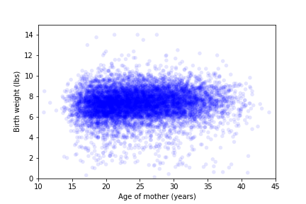
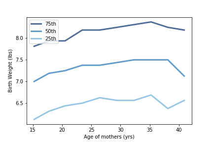

[Think Stats Chapter 7 Exercise 1](http://greenteapress.com/thinkstats2/html/thinkstats2008.html#toc70) (weight vs. age)

**Exercise 1**   Using data from the NSFG, make a scatter plot of birth weight versus mother’s age. Plot percentiles of birth weight versus mother’s age. Compute Pearson’s and Spearman’s correlations. How would you characterize the relationship between these variables?

Scatter plot  
```python
import first
live, firsts, others = first.MakeFrames()
live = live.dropna(subset=['agepreg', 'totalwgt_lb'])

thinkplot.Scatter(live.agepreg, live.totalwgt_lb, alpha=0.1)
thinkplot.Config(xlabel='Age of mother (years)',
                     ylabel='Birth weight (lbs)',
                     xlim=[10, 45],
                     ylim=[0, 15],
                     legend=False)
```


Plot of percentiles
```python
bins = np.arange(10, 48, 3)
indices = np.digitize(live.agepreg, bins)
groups = live.groupby(indices)

ages = [group.agepreg.mean() for i, group in groups][1:-1]
cdfs = [thinkstats2.Cdf(group.totalwgt_lb) for i, group in groups][1:-1]

thinkplot.PrePlot(3)
for percent in [75, 50, 25]:
    weight_percentiles = [cdf.Percentile(percent) for cdf in cdfs]
    label = '%dth' % percent
    thinkplot.Plot(ages, weight_percentiles, label=label)

thinkplot.Config(xlabel='Age of mothers (yrs)',
                 ylabel='Birth Weight (lbs)',
                 legend=True)
```


**Answer:**  
> Mother's age and birth weight are weakly correlated, as indicated by Pearson's Correlation of 0.07 and Spearman's correlation of 0.09.  The percentile plot suggests that the two variables have non-linear relationship
