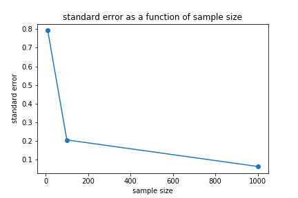

[Think Stats Chapter 8 Exercise 2](http://greenteapress.com/thinkstats2/html/thinkstats2009.html#toc77) (scoring)

**Exercise 2**  
Suppose you draw a sample with size n=10 from an exponential distribution with λ=2. Simulate this experiment 1000 times and plot the sampling distribution of the estimate L. Compute the standard error of the estimate and the 90% confidence interval.  

Repeat the experiment with a few different values of n and make a plot of standard error versus n.  

**answer**  
Define a function to simulate experiment
```python
def SimulateSampleExp(lam=2, n=10, iters=1000):
    import matplotlib.pyplot as plt
    estimates = []
    for j in range(iters):
        xs = np.random.exponential(1/lam, n)
        lamhat = 1.0 / np.mean(xs)
        estimates.append(lamhat)

    cdf = thinkstats2.Cdf(estimates)
    ci = cdf.Percentile(5), cdf.Percentile(95)
    stderr = RMSE(estimates, lam)
    print('standard error: ', stderr)
    print('confidence interval: ', ci)

    thinkplot.Cdf(cdf)
    thinkplot.Config(xlabel='Estimate',
                 ylabel='CDF')
    thinkplot.Plot([ci[0], ci[0]], [0, 1], color='0.8', linewidth=3)
    thinkplot.Plot([ci[1], ci[1]], [0, 1], color='0.8', linewidth=3)

    return stderr
```
Simulate experiment over n = 10, 100, and 1000
```python
xs = [10,100,1000]
ys = []
for each in xs:
    ys.append(SimulateSampleExp(n=each))
fig = plt.figure()
plt.plot(xs, ys,'o-')
plt.xlabel('sample size')
plt.ylabel('standard error')
plt.title('standard error as a function of sample size')
fig.savefig('stderrorVsN.png')
# output
#standard error:  0.7923853999783228
#confidence interval:  (1.2734169305145795, 3.659343239519807)
#standard error:  0.20581581348687014
#confidence interval:  (1.7153390498300842, 2.389084912615024)
#standard error:  0.06343709450691382
#confidence interval:  (1.89444731187361, 2.106115156400291)
```



> Std error for n=10 is 0.792, 90% confidence interval is (1.27, 3.65)
> as n increases, standard error decreases
