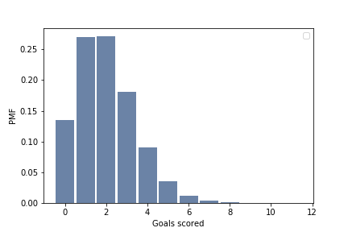
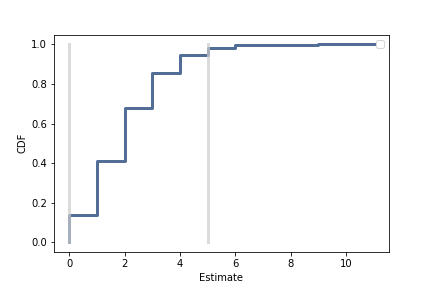

[Think Stats Chapter 8 Exercise 3](http://greenteapress.com/thinkstats2/html/thinkstats2009.html#toc77)

---
**Exercise 3**  
In games like hockey and soccer, the time between goals is roughly exponential. So you could estimate a team’s goal-scoring rate by observing the number of goals they score in a game. This estimation process is a little different from sampling the time between goals, so let’s see how it works.  

Write a function that takes a goal-scoring rate, lam, in goals per game, and simulates a game by generating the time between goals until the total time exceeds 1 game, then returns the number of goals scored.  

```python
def SimulateGame(lam):
    """Simulates a game and returns the estimated goal-scoring rate.

    lam: actual goal scoring rate in goals per game
    """
    goals = 0
    t = 0
    while True:
        time_between_goals = random.expovariate(lam)
        t += time_between_goals
        if t > 1:
            break
        goals += 1

    # estimated goal-scoring rate is the actual number of goals scored
    L = goals
    return L
```

Write another function that simulates many games, stores the estimates of lam, then computes their mean error and RMSE.  
Is this way of making an estimate biased?

```python
def SimulateManyGames(lam = 2, m = 100000):
    ''' Simulates m number of games with the rate lam
    and prints out RMSE, MeanError
    '''
    estimates = []
    for _ in range(m):
        L = SimulateGame(lam)
        estimates.append(L)

    print('rmse L', RMSE(estimates, lam))
    print('mean error L', MeanError(estimates, lam))
    fig = plt.figure()
    pmf = thinkstats2.Pmf(estimates)
    thinkplot.Hist(pmf)
    thinkplot.Config(xlabel='Goals scored', ylabel='PMF')
    fig.savefig('HistogramGoals.png')
    return estimates
res = SimulateManyGames()
#Output:
#rmse L 1.414814475470194
#mean error L 0.00158
```
  
> the mean error is close to 0, so the estimate is unbiased
>> **ThinkStats Section 8.2**, _An estimator is unbiased if the expected total (or mean) error, after many iterations of the estimation game, is 0._

Plot the sampling distribution of the estimates and the 90% confidence interval. What is the standard error?  
 What happens to sampling error for increasing values of lam?  

```python
def SamplingDistribution(estimates,lam = 2):
    cdf = thinkstats2.Cdf(estimates)
    ci = cdf.Percentile(5), cdf.Percentile(95)
    stderr = RMSE(estimates, lam)
    print('standard error: ', stderr)
    print('confidence interval: ', ci)

    fig = plt.figure()
    thinkplot.Cdf(cdf)
    thinkplot.Config(xlabel='Estimate',
                 ylabel='CDF')
    thinkplot.Plot([ci[0], ci[0]], [0, 1], color='0.8', linewidth=3)
    thinkplot.Plot([ci[1], ci[1]], [0, 1], color='0.8', linewidth=3)
    fig.savefig('samplingDistribution.png')

SamplingDistribution(res)
# Output
# Standard error:  1.4155387666892065
# confidence interval:  (0, 5)
```
  
> When lam is increased, the standard error is also increased

---
